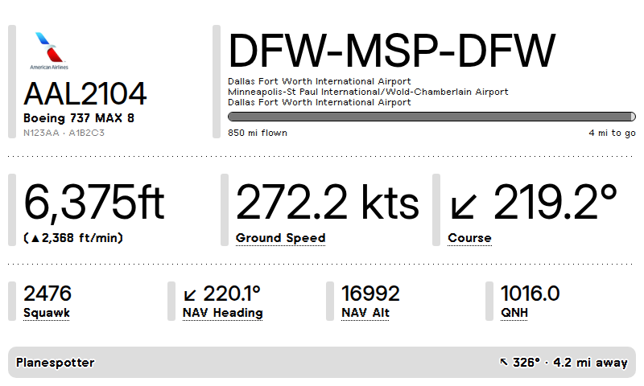

# TRMNL Planespotter

Show the closest aircraft your own ADS-B receiver can see on a [TRMNL](https://trmnl.com) e-ink display.

This is a personal version of [ervansetiawan/itsaplane-trmnl](https://github.com/ervansetiawan/itsaplane-trmnl).
The original asks the public adsb.lol API what's overhead. This version reads directly from the
**tar1090 / readsb** feeder running on your Raspberry Pi. The route (e.g. `DFW-MSP-DFW`) still comes
from adsb.lol's public [VRS standing data](https://github.com/adsblol/vrs-standing-data), and airline
logos are loaded from the upstream repo.



## How it works

```
readsb/tar1090 (Pi) ──aircraft.json──▶ planespotter.py ──webhook POST──▶ TRMNL ──▶ your display
                                            │
                                            └── route lookup: vrs-standing-data.adsb.lol
```

Your Pi is almost certainly not reachable from the internet, so by default the script **pushes**
to a TRMNL *webhook* private plugin. No port forwarding or tunnel is needed.

For each update it:

1. Reads `aircraft.json` and gets your receiver's location from `receiver.json`, or from `RECEIVER_LAT`/`RECEIVER_LON`.
2. Drops aircraft with no position, a position older than `MAX_POSITION_AGE`, or outside `RADIUS`.
3. Picks the closest one. With `PREFER_AIRLINERS=1`, large aircraft (ADS-B category A3–A5) win when any are in range.
4. Looks up the route and works out which leg the aircraft is on. For multi-stop and out-and-back routes it uses the aircraft's track, so the flown / to-go progress bar is correct.
5. POSTs the result as `merge_variables` to your TRMNL webhook.

## Setup

### 1. Create the TRMNL plugin

1. In TRMNL, go to **Plugins → Private Plugin → New**, name it *Planespotter*, and set **Strategy: Webhook**.
2. Save the plugin, then copy the **Webhook URL** it shows.
3. Open **Edit Markup**. Paste `markup/full.liquid` into the *Full* tab and `markup/quadrant.liquid` into the *Quadrant* (and optionally *Half*) tabs.
4. Add the plugin to a playlist.

### 2. Install on the Pi

```bash
cd ~
git clone https://github.com/nguyenware/trmnl-planespotter.git
cd trmnl-planespotter
python3 -m venv .venv
.venv/bin/pip install -r requirements.txt
cp .env.example .env
nano .env            # paste TRMNL_WEBHOOK_URL, check TAR1090_URL
```

Test it without pushing anything. This prints the payload for the closest aircraft right now:

```bash
.venv/bin/python planespotter.py once
```

If tar1090 isn't at `http://localhost/tar1090`, set `TAR1090_URL`. You can also point
`AIRCRAFT_JSON`/`RECEIVER_JSON` at readsb's files directly, e.g. `/run/readsb/aircraft.json`.
If `receiver.json` has no location, set `RECEIVER_LAT` and `RECEIVER_LON`.

### 3. Run it on boot

```bash
# edit User/WorkingDirectory/ExecStart if your user or path isn't pi / /home/pi
sudo cp planespotter.service /etc/systemd/system/
sudo systemctl daemon-reload
sudo systemctl enable --now planespotter
journalctl -u planespotter -f
```

## Settings (`.env`)

| Variable | Default | Notes |
|---|---|---|
| `TRMNL_WEBHOOK_URL` | – | Required for `push` mode. |
| `TAR1090_URL` | `http://localhost/tar1090` | Base URL; reads `/data/aircraft.json` and `/data/receiver.json`. |
| `AIRCRAFT_JSON`, `RECEIVER_JSON` | derived | Override with a URL or a local file path. |
| `RECEIVER_LAT`, `RECEIVER_LON` | from `receiver.json` | Receiver location. |
| `RADIUS` | `25` | Search radius, in `DISTANCE_UNIT`. |
| `DISTANCE_UNIT` | `mi` | `mi`, `nm` or `km`. |
| `PREFER_AIRLINERS` | `1` | `0` shows the closest aircraft of any kind. |
| `MAX_POSITION_AGE` | `60` | Seconds. |
| `PUSH_INTERVAL` | `300` | Seconds. TRMNL allows 12 webhook posts per hour (30 with TRMNL+), so don't go below 300 (120 with TRMNL+). |
| `LOGO_BASE_URL` | upstream repo's `logos/` | Must be publicly reachable, because TRMNL's servers render the image. |
| `HOST`, `PORT` | `0.0.0.0`, `5000` | `serve` mode only. |

## Modes

```bash
python planespotter.py push    # default: POST to the TRMNL webhook every PUSH_INTERVAL seconds
python planespotter.py once    # print the payload once and exit
python planespotter.py serve   # serve the payload at http://<pi>:5000/closest_flight
```

`serve` is for a **polling** plugin. It's useful if you run a self-hosted BYOS server
(Terminus, LaraPaper, …) on your LAN, or expose the Pi through Tailscale Funnel or a Cloudflare Tunnel.
The JSON is the same as the webhook payload, so the same markup works.

## Payload

The variables available in the markup:

`status` (`ok` / `empty`), `flight`, `hex`, `reg`, `type`, `model`, `alt` (feet or `"ground"`),
`rate`, `rate_arrow`, `gs`, `track`, `track_arrow`, `squawk`, `emergency`, `nav_heading`,
`nav_heading_arrow`, `nav_alt`, `qnh`, `dist`, `dir`, `dir_arrow`, `route`, `airports`, `flown`,
`to_go`, `progress` (0–100), `logo`, `unit`, `updated`, and `radius` (only when `status` is `empty`).

`reg` and `type` come from readsb's aircraft database (the `r`/`t` fields, present when readsb runs with `--db-file`).
Without them, `model` is empty.

## Development

```bash
pip install -r requirements.txt pytest
python -m pytest
```

## License

GPL-3.0, like the upstream project this is based on. `aircrafts.csv` and the airline logo list
(`logos.txt`) come from [itsaplane-trmnl](https://github.com/ervansetiawan/itsaplane-trmnl).
